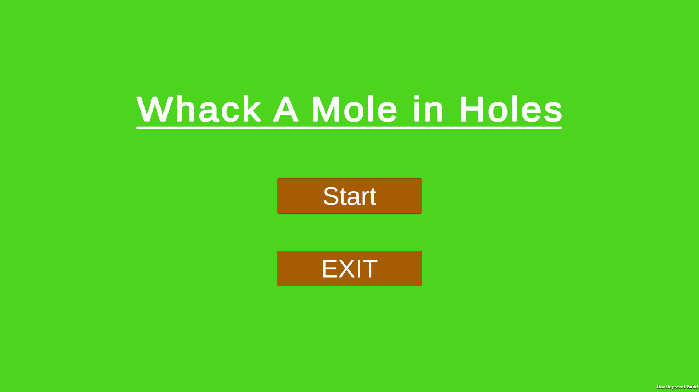
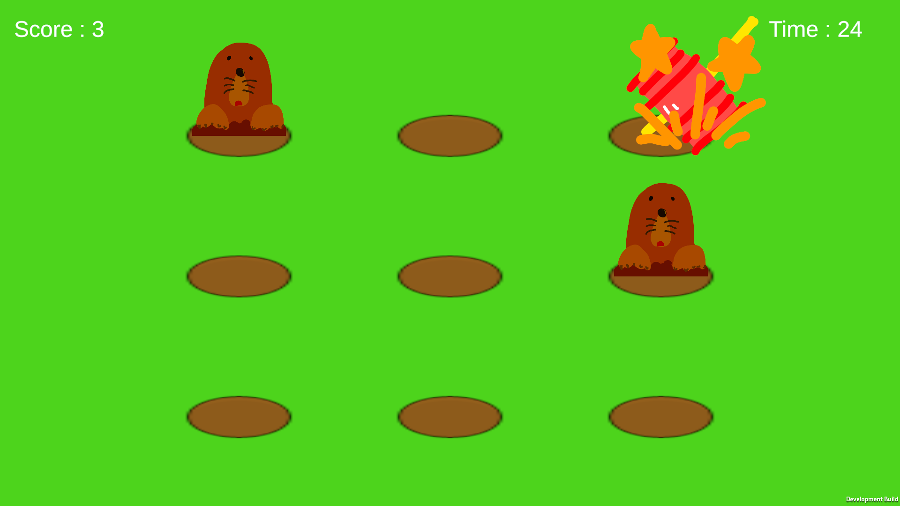
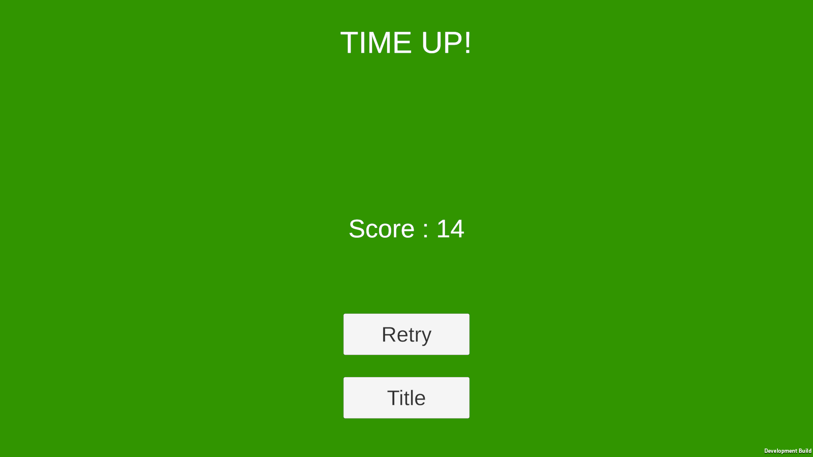

# Whack A Mole in Holes

Unityで制作したモグラたたきゲームです。

## 概要

穴からランダムに出現するモグラを制限時間内にできるだけ多く叩いて高得点を目指します。

## 使用技術

- Unity 6
- C#
- TextMeshPro
- Unity Input System

## 遊び方

- STARTでゲーム開始
- マウスでハンマーを操作
- 左クリックでモグラを叩く
- 制限時間は60秒
- 残り10秒でBGMが加速し、カウントダウンSEが流れます

---

## スクリーンショット

### タイトル

### ゲーム画面

### リザルト

---

## 主な実装内容

- ランダム出現するモグラ
- 同時に1〜3匹出現
- スコア管理
- タイマー管理
- リザルト画面
- Retry / Title遷移
- マウス追従ハンマー
- ヒット・空振りSE
- BGM
- ラスト10秒でBGM加速
- GitHubによるバージョン管理

## 作者

よんばん